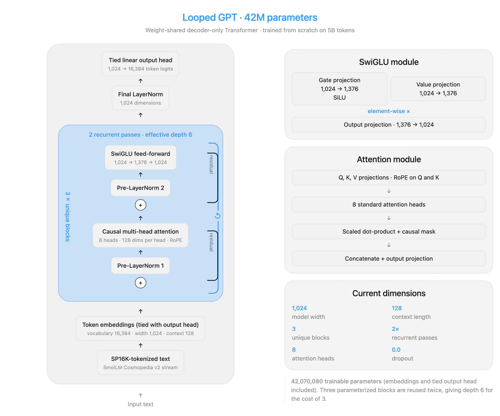
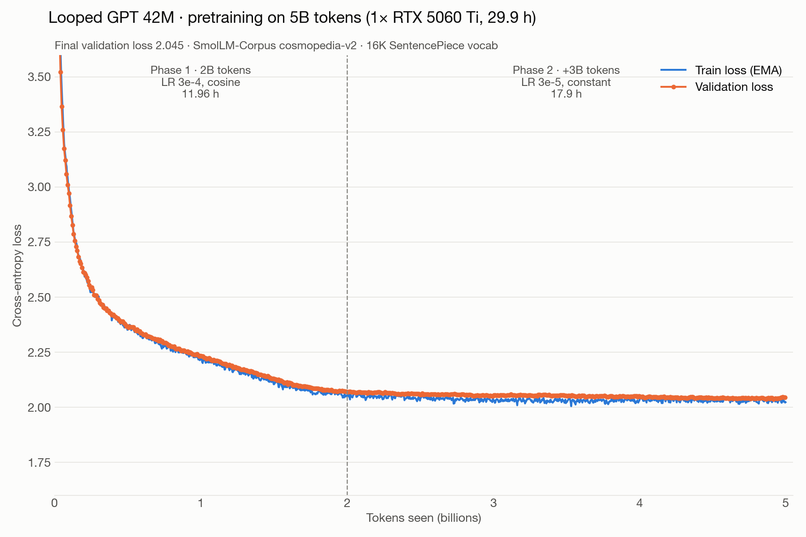
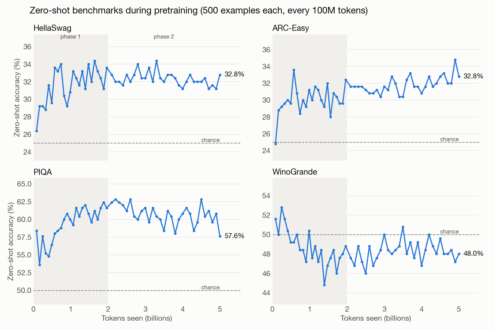

# Looped GPT-42M

A 42M-parameter language model trained **from scratch** for Track 01 (Foundational LLM, ≤ 50M parameters) of the
[Global Innovation Build Challenge V2](https://gibc-v2.devpost.com/).

The core idea is **weight sharing in depth**: three unique Transformer blocks are applied twice (a *looped*
Transformer), so the model computes with an effective depth of 6 while paying parameters for 3. The parameters
saved, together with a compact 16K SentencePiece vocabulary and tied embeddings, are spent on width.



- 🎬 Demo video (2:58): https://youtu.be/tdG0UXg4qSI
- 📈 Training logs: Weights & Biases project `gpt2-50M`, runs `qe9x3h4q` (phase 1) and `qutvxppl` (phase 2)
- 💾 Weights: Hugging Face [`50m-llm/mi-llm-50m-checkpoints`](https://huggingface.co/50m-llm/mi-llm-50m-checkpoints) — submitted model: [`rsi-2b-to-5b/checkpoints/checkpoint-5.0B.pt`](https://huggingface.co/50m-llm/mi-llm-50m-checkpoints/blob/main/rsi-2b-to-5b/checkpoints/checkpoint-5.0B.pt) (SHA-256 `a77a3bdb…`, the file evaluated below); phase-1 checkpoint: `rsi-2b-20260917/final.pt`

## Model

| | |
|---|---|
| **Trainable parameters** | **42,070,080** (token embeddings and output head included; the head is tied to the embeddings) |
| Architecture | decoder-only, pre-norm; 3 unique blocks × 2 loops (effective depth 6) |
| Width / heads | 1,024 / 8 (multi-head attention, 128 dims per head) |
| Attention | causal, RoPE, fused `scaled_dot_product_attention` |
| Feed-forward | SwiGLU, 1,024 → 1,376 → 1,024 |
| Vocabulary | SentencePiece BPE, 16,384 tokens ([Parameter Golf tokenizer](https://huggingface.co/datasets/Natooka/parameter-golf-sp-tokenizers)) |
| Context length | 128 tokens |
| Code | `LoopedGPTModel` in [`src/llm_mini_lab/models/gpt.py`](src/llm_mini_lab/models/gpt.py) |

Parameter breakdown: token embeddings (shared with the output head) 16,777,216 · each Transformer block 8,430,272
(× 3 unique blocks = 25,290,816) · final LayerNorm 2,048. With GPT-2's 50,257-token vocabulary the embedding table
alone (51.5M) would exceed the cap.

To print the count yourself:

```python
import torch, sys; sys.path.insert(0, "src")
from llm_mini_lab.models import LoopedGPTModel
ckpt = torch.load("checkpoint-5.0B.pt", map_location="cpu", weights_only=False)
model = LoopedGPTModel(ckpt["config"]); model.load_state_dict(ckpt["model_state_dict"])
print(sum(p.numel() for p in model.parameters() if p.requires_grad))   # 42070080
```

## Training

Data: [SmolLM-Corpus](https://huggingface.co/datasets/HuggingFaceTB/smollm-corpus), `cosmopedia-v2` subset (synthetic
textbooks), streamed from Hugging Face. Script: [`scripts/train_looped_gpt_5b.py`](scripts/train_looped_gpt_5b.py)
(reconstructed from the checkpoint and the W&B run configs; the original ran on a collaborator's machine).

| Phase | Tokens | Optimizer / LR | Time |
|---|---|---|---|
| 1 | 0 → 2B | AdamW, 3e-4, 5% warmup, cosine decay to 3e-5 | 11.96 h |
| 2 | 2B → 5B | AdamW, constant 3e-5 (continued from phase 1) | 17.9 h |
| **Total** | **5B tokens** | weight decay 0.05, grad clip 1.0, bf16 autocast, 8,192 tokens/update | **29.9 h** |



**Hardware.** Final model: a single **NVIDIA GeForce RTX 5060 Ti (16 GB)** provided by a collaborator (Windows 11).
Ablations: collaborator GPUs (RTX 3060, 3080, 3090, 4070 SUPER, TITAN RTX, GTX 1660 Ti, RTX 5090 Laptop) and rented
cloud GPUs (Tesla V100).

**Efficiency.** ≈ 46K tokens/s average, peak GPU memory < 2 GB.

**Compute.** ≈ 2.0 × 10¹⁸ FLOPs for the final run (6·N·D, counting both loop passes and the output head:
N ≈ 67.4M multiply-accumulate parameters per token, D = 5 × 10⁹ tokens).

## Evaluation

Script: [`scripts/eval_lm_harness.py`](scripts/eval_lm_harness.py) — raw output in
[`results/eval_lm_harness_5B.json`](results/eval_lm_harness_5B.json).

| Benchmark (0-shot, full split) | acc | acc_norm | random chance |
|---|---|---|---|
| HellaSwag | 27.5 ± 0.4 | 28.4 ± 0.4 | 25 |
| ARC-Easy | 39.9 ± 1.0 | 37.6 ± 1.0 | 25 |
| PIQA | 59.3 ± 1.1 | 59.0 ± 1.1 | 50 |
| WinoGrande | 50.2 ± 1.4 | — | 50 |

| WikiText-103 test perplexity (held-out) | value |
|---|---|
| token perplexity (SentencePiece 16K) | 129.9 |
| word perplexity | 2105.4 |
| bits per byte | 2.068 |

Benchmarks: lm-evaluation-harness 0.4.9.1, zero-shot, accuracy in % with standard error. WikiText-103:
`Salesforce/wikitext`, `wikitext-103-raw-v1`, test split (revision `b08601e04326`), one EOS after each text
row, packed into non-overlapping 128-token windows (376,320 scored tokens), following
[`configs/data_protocols/wikitext103_split_reference.json`](configs/data_protocols/wikitext103_split_reference.json).
Word perplexity and bits per byte are tokenizer-independent. Checkpoint SHA-256 `a77a3bdbdd53d3db…`.

During training, the same four benchmarks were tracked every 100M tokens with our own lightweight scorer
(500-example subsets, length-normalized log-likelihood), so those curves are noisier and not directly
comparable with the official numbers above:



**Loops at inference.** Because the blocks are shared, the number of loops can be changed when running the model.
Perplexity on a 51,200-token sample of the WikiText-103 test split (128-token windows,
[`results/loops_vs_perplexity.json`](results/loops_vs_perplexity.json)): 1 loop 254 · **2 loops (as trained) 130** ·
3 loops 135 · 4 loops 158. The second pass halves perplexity; looping more than in training does not help.

## How we got here

One change at a time, every run in W&B (`notebooks/`, plots in `assets/`): GPT-2-style baseline → cosine schedule →
Xavier init → SwiGLU → depth vs. width → **looped Transformer** → larger batches → **RoPE** → **16K vocabulary**.
Also explored: Muon optimizer, grouped-query attention (`notebooks/gqa_vs_mha/`), fused attention kernels with
equivalence tests, tied embeddings, and an agent-driven autoresearch loop.

## Install and run

```bash
python -m venv .venv && source .venv/bin/activate
pip install -e ".[training,eval]"
# tokenizer: tokenizers/fineweb_16384_bpe.model (included)

# train (phase 1, then phase 2)
python scripts/train_looped_gpt_5b.py --phase base
python scripts/train_looped_gpt_5b.py --phase extend --init-from checkpoints/looped-gpt-2b.pt

# evaluate
python scripts/eval_lm_harness.py --checkpoint checkpoints/looped-gpt-5b.pt
```

Text generation with the trained checkpoint: `Post_Training/SFT/SFT_v1.ipynb` pattern, or

```python
import torch, sys, sentencepiece as spm; sys.path.insert(0, "src")
from llm_mini_lab.models import LoopedGPTModel
ckpt = torch.load("checkpoint-5.0B.pt", map_location="cpu", weights_only=False)
model = LoopedGPTModel(ckpt["config"]).eval(); model.load_state_dict(ckpt["model_state_dict"])
sp = spm.SentencePieceProcessor(model_file="tokenizers/fineweb_16384_bpe.model")
ids = torch.tensor([sp.encode("Photosynthesis is the process by which")])
for _ in range(40):
    logits = model(ids[:, -128:])[:, -1] / 0.7
    v, _ = torch.topk(logits, 40); logits[logits < v[:, [-1]]] = -float("inf")
    ids = torch.cat([ids, torch.multinomial(torch.softmax(logits, -1), 1)], 1)
print(sp.decode(ids[0].tolist()))
```

## Built with

PyTorch · SentencePiece · Hugging Face `datasets` / `huggingface_hub` · Weights & Biases · lm-evaluation-harness ·
NumPy · Matplotlib · Jupyter · manim and Google Cloud Text-to-Speech (demo video only).
Datasets: SmolLM-Corpus (cosmopedia-v2), FineWeb-Edu (ablations), WikiText-103, HellaSwag, ARC, PIQA, WinoGrande.
Tokenizer: Parameter Golf SentencePiece 16K (Natooka/parameter-golf-sp-tokenizers).

## AI assistance

As required by the rules: **OpenAI Codex** was used for most code refactors, training scripts and notebooks;
**Claude / Claude Code** for debugging, the evaluation adapter (`scripts/eval_lm_harness.py`), the reconstructed
training script, documentation and the demo video. The demo video narration is synthetic (Google Cloud TTS).
All design decisions, experiments and training runs were directed and verified by the team.

## Team and credits

Oscar Hernandez, with collaborators who provided GPU hardware and contributed the orchestration, telemetry and
data-protocol tooling (`tools/`, `configs/`, `docs/`). Fused-attention contribution by a mentor (PR #1).
