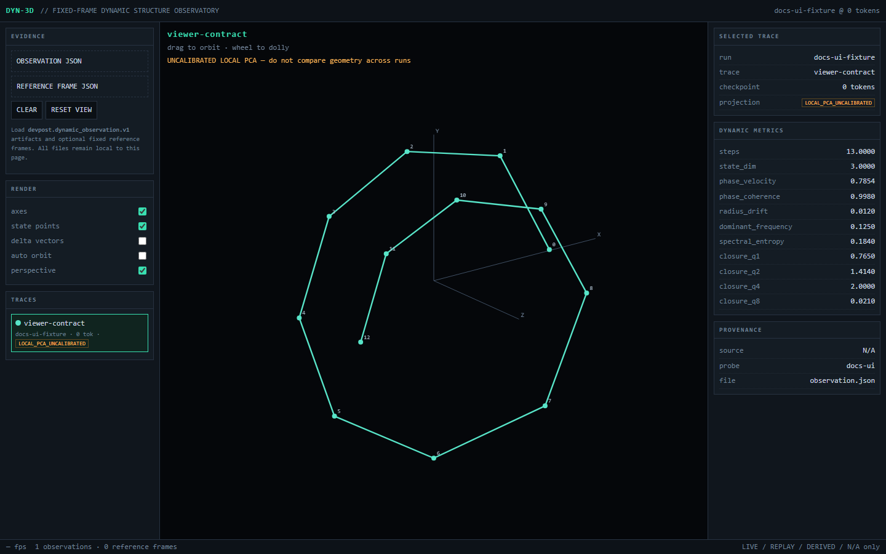
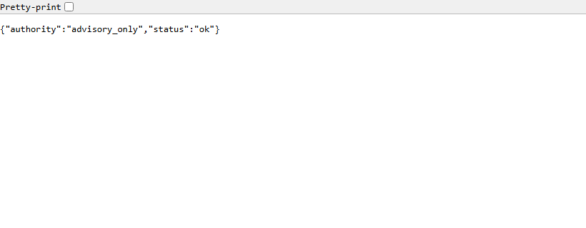

# Devpost Hackathon — 50M_LLM autoresearch runbook

This runbook is the operator companion to [`adr/ADR-0001-governed-autoresearch-evidence-boundaries.md`](adr/ADR-0001-governed-autoresearch-evidence-boundaries.md).

It covers the merged `rsi_exp` architecture-search, W&B/ARIA feedback, Dynamic Observatory and DYN-3D surfaces. The local orchestrator/data-protocol candidate is documented separately at the end because it lives on another branch and remains owner-review only.

## 1. Authority before action

Before operating the system, distinguish these actions:

- **observe:** read logs, metrics, artifacts, viewer output or advisory analyses;
- **propose:** formulate a candidate experiment;
- **prepare:** construct config/RunSpec without executing it;
- **execute:** start training or another experiment process;
- **publish:** push, open/update a PR, request review, merge or release.

These are not interchangeable. External ARIA output and DYN-3D visualizations are observation/proposal inputs only. The owner-review gate for the local orchestrator candidate applies independently of whether tests pass.

## 2. Checkout and preflight

Use a clean checkout of the intended branch. The merged autoresearch surface documented here is `rsi_exp` at or after `c16e4cc`.

```powershell
git status --short --branch
git rev-parse HEAD
git log -1 --oneline --decorate
```

Do not run a new experiment from a dirty tree unless the dirty state is intentional, recorded, and part of the experiment identity.
## 3. Environment setup

From the `rsi_exp` root:

```powershell
uv sync
uv run prepare.py
```

`prepare.py` must complete before training. Confirm these fixed resources exist:

```text
data/smollm_local/train.txt
data/smollm_local/validation.txt
tokenizers/fineweb_16384_bpe.model
```

Current fixed/search controls are defined in `program.md` and `train.py`. At the documented baseline they include:

```text
seed                 123
context length       128
batch size           2
learning rate        3e-4
weight decay         0.05
max training tokens  1,000,000
selection metric     test_loss (lower is better)
parameter ceiling    50,000,000
```

If any intended experiment changes a fixed scientific control rather than a candidate parameter, classify it as a protocol revision and stop treating it as directly comparable to the old baseline.
## 4. Baseline or candidate run

Run training with an explicit log capture:

```powershell
uv run train.py *> run.log
```

The run is valid for RSI selection only if it exits successfully and ends with an unambiguous metric line:

```powershell
Select-String -Path run.log -Pattern '^test_loss='
Get-Content run.log -Tail 40
```

Expected terminal fields include device, vocabulary size, parameter count, train/test block counts, update count, periodic train/test losses, elapsed time, token count, and final `test_loss`.

Each normal run also creates a W&B run in project `gpt2-50M` with configuration, `train/loss`, `train/lr`, `tokens_seen`, `test/loss`, elapsed time and final `test_loss` summary.

Create or maintain local `results.tsv` outside commits with columns `commit`, `test_loss`, `status`, and `description`. Statuses are `keep`, `discard`, or `crash`. Never encode a crash as an artificial numeric improvement.
## 5. Architecture experiment loop

1. Start from the best admissible `test_loss` commit under the same protocol.
2. Record one concrete hypothesis and the intended independent variable.
3. Change only `train.py` and/or `rsi_architecture/` inside the declared mutation policy.
4. Commit the candidate before running it so the code identity is recoverable.
5. Run the exact training command from section 4.
6. Record the result and supporting evidence.
7. Keep or discard the candidate using the current protocol's `test_loss` rule.

The candidate factory contract is:

```text
input:  token IDs [batch, tokens]
output: logits    [batch, tokens, vocab_size]
limit:  parameters <= 50,000,000
```

Do not edit `src/llm_mini_lab/`, data files, tokenizer, token budget or `test_loss` calculation as part of an ordinary architecture search mutation.

Before interpreting a small numerical change as causal, check environment identity: Git SHA, seed, OS, Python, PyTorch/CUDA stack, GPU, dataset/tokenizer identity, token budget and evaluation procedure.
## 6. Enable passive dynamic observation

Dynamic observation is off by default. To enable the final-run probe:

```powershell
$env:AUTORESEARCH_DYNAMICS = '1'
$env:AUTORESEARCH_DYNAMICS_PROBE_ID = 'validation-head-v1'
uv run train.py *> run-with-dynamics.log
```

Optional explicit module selection:

```powershell
$env:AUTORESEARCH_DYNAMICS_MODULES = 'trf_blocks.0,trf_blocks.1,trf_blocks.2'
```

If module names are omitted, the observer discovers repeated outer modules during a passive inference pass.

Local observations are written beneath:

```text
.autoresearch/dynamics/<wandb-run-id>/<tokens-seen>/
```

W&B receives diagnostic scalars under `dynamics/<trace>/...` and observation JSON as a `dynamic-observation` artifact when the logging path succeeds.

Check the run summary for:

```text
dynamics/status = ok | error
dynamics/observation_count = <integer>
dynamics/error_type = <exception type, only on failure>
```

A dynamics error is advisory. It must not be used to replace, repair, or reinterpret the final `test_loss`.
## 7. Build and preserve a fixed reference frame

Choose a baseline observation only after confirming its run/probe/trace identity is the reference you intend to reuse.

```powershell
uv run python -m dynamic_observatory.cli reference `
  .\path\baseline-observation.json `
  .\path\baseline-frame.json
```

The output schema is `devpost.dynamic_reference_frame.v1`. Preserve the file with its baseline run identity and token checkpoint; do not regenerate it independently for each candidate if the purpose is cross-run displacement comparison.

A compatible observation/reference pair must agree on probe ID, trace name and state dimensionality.

## 8. Inspect dynamics in DYN-3D

Open:

```text
tools/dynamic_observatory_viewer/index.html
```

Then:

1. Load one or more `devpost.dynamic_observation.v1` files.
2. Load the matching `devpost.dynamic_reference_frame.v1` file for cross-run comparison.
3. Verify the selected trace is labeled `FIXED_REFERENCE` before comparing geometry between runs.
4. Treat `LOCAL_PCA_UNCALIBRATED` as a within-trajectory view only.
5. Inspect token checkpoint, source, probe, file and frame provenance in the right panel.
6. Use state points/delta vectors as visual diagnostics; do not turn the view itself into a hidden selection score.


For the guard behavior, see:


## 9. Run the signed W&B/ARIA advisory receiver

Set secrets only in the process environment; do not write them into documentation, RunSpecs or commits.

```powershell
$env:WANDB_WEBHOOK_SECRET = '<team webhook secret>'
$env:WANDB_WEBHOOK_BEARER = '<optional bearer token>'
$env:AUTORESEARCH_WANDB_ENTITY = '<expected W&B entity>'
$env:AUTORESEARCH_WANDB_PROJECT = '<expected W&B project>'
uv run python -m autoresearch_feedback.server
```

Default endpoint:

```text
http://127.0.0.1:8787
```

Health check from another terminal:

```powershell
Invoke-RestMethod http://127.0.0.1:8787/healthz
```

Expected semantic response:

```json
{"authority":"advisory_only","status":"ok"}
```

Do not expose the receiver directly to the public internet. If cloud delivery is required, terminate public HTTPS/authentication in a separately controlled relay or reverse proxy and forward only the verified callback path to this local receiver.

Non-loopback binding requires the explicit `--allow-non-loopback` flag; that flag is not a substitute for perimeter authentication.
## 10. Inspect ARIA evidence and receipts

Accepted analyses are append-only under:

```text
.autoresearch/aria-inbox/
  analyses/<content-sha256>.json
  ids/<sha256-of-analysis-id>.json
  receipts/<content-sha256>.json
```

A valid new payload returns HTTP `202`. An identical replay returns `200` as a duplicate. Important rejection codes are:

| Status | Meaning |
|---:|---|
| 400 | malformed JSON or contract failure |
| 401 | bad/missing signature or bearer token |
| 403 | W&B entity/project does not match the allowlist |
| 409 | same `analysis_id` reused for different canonical content |
| 413 | body exceeds the configured maximum |
| 415 | content type is not `application/json` |

The stored analysis is advisory evidence. Acceptance means only that the payload passed the transport/contract boundary; it does not mean its hypothesis is correct or its proposed experiment is authorized.

Use the typed inbox API when consuming evidence programmatically:

```python
from pathlib import Path
from autoresearch_feedback.store import AnalysisInbox

inbox = AnalysisInbox(Path('.autoresearch/aria-inbox'))
for receipt in inbox.list_receipts():
    analysis = inbox.load(receipt.digest)
    print(receipt.received_at, analysis.analysis_id, analysis.authority)
```

Do not derive execution commands directly from unreviewed free text outside the typed contract.
## 11. Verification pass before review

From a clean worktree:

```powershell
uv sync
uv run prepare.py
uv run python -m unittest discover -s tests -v
uv run python -m compileall train.py rsi_architecture src tests
git diff --check
git status --short
```

Verify the baseline factory separately if the architecture surface changed:

```powershell
uv run python -c "from rsi_architecture import build_model; from train import LOOPED_GPT_CONFIG,MODEL_CONFIG,MAX_LENGTH,TOKENIZER_NAME,TOKENIZER_MODEL; from llm_mini_lab.training import load_tokenizer,tokenizer_vocab_size; t=load_tokenizer(TOKENIZER_NAME,TOKENIZER_MODEL); c={**LOOPED_GPT_CONFIG,**MODEL_CONFIG,'context_length':MAX_LENGTH,'vocab_size':tokenizer_vocab_size(t),'tokenizer_name':TOKENIZER_NAME}; m=build_model(c); print(type(m).__name__, sum(p.numel() for p in m.parameters()))"
```

The parameter count must remain at or below 50,000,000. A changed count is not automatically a problem, but it must be expected and attributable to the candidate architecture.

The verification suite checks, among other things, the candidate shape contract, 50M ceiling, signed advisory ingestion, idempotence/conflict handling, path confinement, passive capture, observer error isolation, RNG preservation, fixed-frame projection semantics, reference serialization, and offline viewer contract.

A passing suite establishes software-contract evidence. It does not establish model-quality improvement or official benchmark completion.
## 12. Failure recovery

| Symptom | Interpretation | Operator action |
|---|---|---|
| `FileNotFoundError` for tokenizer/data | Fixed resource missing | Restore the exact reviewed resource; do not substitute another corpus/tokenizer silently |
| `model exceeds 50M` | Candidate violates hard ceiling | Reject candidate before training |
| non-finite training loss | Run invalid | Record `crash`, inspect logs, return to last good commit |
| no final `test_loss=` | Selection evidence incomplete | Treat as invalid/crash; do not infer result from an intermediate W&B point |
| W&B unavailable | Remote evidence sink failed | Preserve local log/result; do not invent remote evidence |
| `dynamics/status=error` | Passive observer failed | Preserve final `test_loss`; inspect observer separately |
| DYN-3D says `LOCAL_PCA_UNCALIBRATED` | No compatible fixed frame | Do not compare absolute geometry across runs |
| ARIA 401 | Signature/bearer failure | Check the exact shared secret/header/body bytes; do not bypass verification |
| ARIA 403 | Scope mismatch | Verify expected W&B entity/project and sender identity |
| ARIA 409 | ID reused with different content | Preserve existing record; issue a new analysis identity upstream |
| Receiver needs public delivery | Local endpoint is unreachable from cloud | Use a controlled authenticated relay; do not simply expose port 8787 |

For any ambiguous state, preserve evidence first. Do not delete or rewrite the old record merely to make a retry look clean.

## 13. Rollback discipline

Code rollback and scientific evidence rollback are different operations.

- Revert candidate code with Git while retaining the old run evidence.
- Do not rewrite W&B runs, ARIA receipts, dynamic observations or reference frames to match a reverted commit.
- If a reference frame is superseded, keep the old file and create a new identity rather than editing it in place.
- If a protocol changes, create a new comparison family instead of retroactively relabeling prior runs.
## 14. Adjacent local orchestrator candidate

**Status:** local owner-review candidate on `review/orchestrator-data-alignment-20260916t022908z` at `80a926c`; not part of this `rsi_exp` checkout and not approved for publication.

From that candidate's repository root, the generic package can be installed independently of PyTorch:

```powershell
python -m venv .venv
python -m pip install -e "tools/experiment_orchestrator[dev]"
```

Prepare does not enqueue or train:

```powershell
expctl --root ./experiment_runs prepare-ml ./recipe.json --output ./reviewed_run.json
```

After human inspection of the generated RunSpec, local execution is:

```powershell
expctl --root ./experiment_runs submit ./reviewed_run.json
expctl --root ./experiment_runs worker
```

Read-only monitoring surfaces:

```powershell
expctl --root ./experiment_runs serve --port 8766
expctl --root ./experiment_runs watch --run-id <run-id> --stream stdout
expctl --root ./experiment_runs logs <run-id> --stream data-protocol
```

Browser control is disabled unless `serve --allow-control` is explicitly used. That mode emits a session token and remains loopback-only; it is not a public control plane.
### Orchestrator scientific guardrails

A prepared ML recipe must identify the selected model repository, protocol, tokenizer/context controls, source identities, resources and execution interpreter. The executor checks for source/protocol drift before starting the process.

Dependency order means only that a predecessor must succeed before a dependent job is eligible. It does **not** imply checkpoint continuation, optimizer-state carry-over, data mixing or curriculum semantics.

The opt-in data protocol supports explicit `upstream_modulo`, `stable_hash`, and `source_splits` membership semantics. If a new run changes split semantics, treat it as a new experimental protocol.

The package's database is an index over run evidence, not the source of truth. `rebuild` reconstructs the index from evidence. Unknown running processes after a crash block dispatch pending explicit recovery.

### Orchestrator verification

From the local integration candidate:

```powershell
python -m pytest tools/experiment_orchestrator/tests -q
python -m pytest tests -q
git diff --check
```

The included tiny CPU pipeline check is a software integration test, not a model-quality experiment.

A source-only standalone export is created and verified with:

```text
expctl --root unused snapshot-package tools/experiment_orchestrator /path/to/new-release
expctl --root unused verify-package /path/to/new-release
expctl --root unused verify-package /path/to/new-release --source tools/experiment_orchestrator
```

Create a new release directory rather than editing a recorded release in place.
## 15. Owner-review package checklist

Before any new publication of the adjacent integration candidate, present the exact package locally with:

- current branch and commit SHA;
- readable changed-file list and diff summary;
- orchestrator startup instructions;
- experiment-ledger/evidence layout;
- W&B adapter and telemetry behavior;
- data-protocol semantics and known evaluation gaps;
- complete test receipts;
- screenshots of operator-facing surfaces where useful;
- explicit list of unimplemented or intentionally deferred behavior;
- proposed PR title/body and target branch;
- confirmation that no datasets, checkpoints, credentials or unrelated private project files are included.

Do **not** push a branch, open/update a PR, request a reviewer, merge or publish a release for that candidate until the owner has reviewed the actual package and explicitly approved publication.

## 16. Fast operator checklist

Before a comparable RSI run:

```text
[ ] clean/recorded Git state
[ ] correct data + tokenizer present
[ ] fixed token/evaluation contract unchanged
[ ] candidate <= 50M parameters
[ ] one hypothesis / one primary variable
[ ] W&B identity/environment recorded
[ ] final test_loss captured
[ ] result logged keep/discard/crash
[ ] dynamics, if enabled, treated as advisory
[ ] fixed frame present before cross-run geometry claims
[ ] ARIA analysis treated as advisory_only
[ ] publication approval handled separately from implementation
```

When in doubt, preserve the evidence and reduce authority rather than silently inferring permission or comparability.
## 17. Screenshot evidence

The documentation screenshots are intentionally narrow and provenance-labeled. They demonstrate control-surface behavior rather than scientific results.

### ARIA receiver authority



### DYN-3D fixed reference


### DYN-3D comparison guard


See [`screenshots/README.md`](screenshots/README.md) for exact screenshot provenance and non-evidence status.
### Adjacent orchestrator browser qualification


This screenshot comes from the existing standalone-integration review evidence. It documents the local candidate's operator surface and provenance views; it does **not** change its owner-review/publication status.

## 18. Verified checkout portability

`train.py` and `prepare.py` resolve the project resource root in both direct `rsi_exp` checkouts and the earlier nested layout. If setup unexpectedly reports the tokenizer or local data one directory above the checkout, treat that as a regression and run `tests/test_portable_checkout.py` before proceeding.

The 2026-09-17 documentation pass verified a direct worktree with:

```text
prepare.py: PASS
28 unit tests: PASS
compileall: PASS
LoopedGPTModel parameters: 42,070,080
git diff --check: PASS
```
