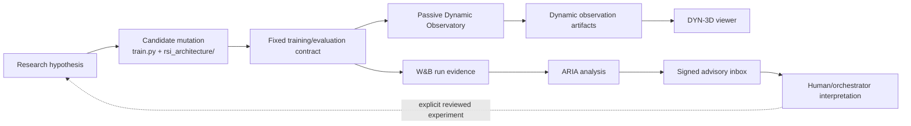
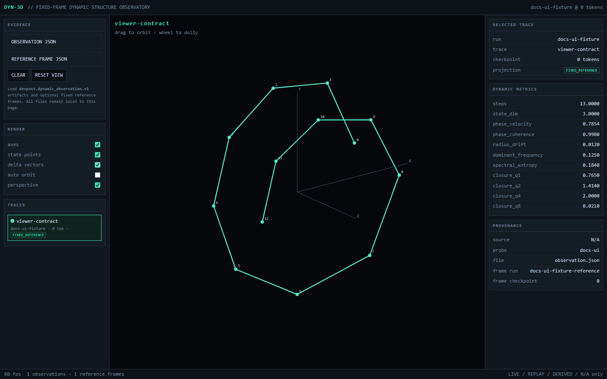
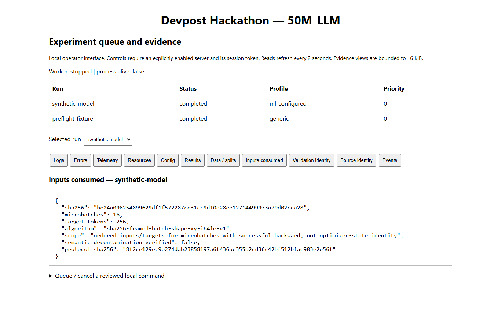

# ADR-0001: Governed autoresearch and evidence boundaries

- **Status:** Accepted for the merged `rsi_exp` surface; adjacent orchestrator package remains owner-review only.
- **Date:** 2026-09-17
- **Project:** Devpost Hackathon — 50M_LLM
- **Merged research baseline:** `origin/rsi_exp` at `c16e4cc`
- **Adjacent local integration candidate:** `review/orchestrator-data-alignment-20260916t022908z` at `80a926c`

## Context

The project now contains several independently useful mechanisms: a bounded architecture mutation surface, W&B experiment logging, signed ARIA advisory feedback ingestion, passive recurrent-state observation, a fixed-frame 3D dynamics viewer, and a separate local experiment orchestrator/data-protocol candidate.

The failure mode is not lack of capability; it is accidental authority collapse. An architecture search agent must be able to change a candidate without moving the measurement apparatus. External analysis must be able to advise without executing. Observability must expose state without altering selection. Operational tooling must record and schedule experiments without silently redefining the scientific protocol.

This ADR defines the authority boundaries, invariants, provenance rules, failure semantics, and current publication state that make those mechanisms composable.

## Decision

Use a **bounded autoresearch architecture** in which candidate mutation, scientific measurement, advisory analysis, dynamic observation, and experiment orchestration are separate authority domains.

The smallest invariant kernel is:

1. Candidate code may change only inside its declared mutation surface.
2. The scientific ruler remains fixed unless project owners explicitly revise the protocol.
3. `test_loss` is the current RSI keep/discard metric.
4. External analysis is evidence, never execution authority.
5. Dynamic observation is passive and cannot affect logits, gradients, optimizer state, token budget, or selection.
6. Cross-run geometry is comparable only inside a persisted fixed reference frame.
7. Every boundary fails closed or advisory-only according to its authority class.
8. Publication remains a separate human approval step from implementation or test success.
## Current state matrix

| Surface | State on 2026-09-17 | Authority |
|---|---|---|
| Architecture mutation boundary (`rsi_architecture/`) | Merged via PR #5 | Candidate construction only |
| Signed W&B/ARIA ingestion (`src/autoresearch_feedback/`) | Merged via PR #6 | Advisory evidence only |
| Dynamic Observatory (`src/dynamic_observatory/`) | Merged via PR #7 | Passive measurement only |
| DYN-3D offline viewer | Merged via PR #7 | Human visualization only |
| W&B scalar/run logging in RSI | Merged/current | Evidence export; no execution authority |
| Main-line telemetry contribution | Merged via PR #4 | Opt-in telemetry/export |
| Local experiment orchestrator + evidence ledger | Implemented locally; not published | Scheduling/execution under operator control |
| Explicit data-protocol package | Implemented locally; owner-review candidate | Protocol validation; opt-in only |
| Official benchmark completion gate | Open | Evaluation only |

The status column is deliberately separate from authority. A merged feature does not gain authority merely because it exists, and a locally implemented feature is not treated as published or accepted upstream.

## System topology



No arrow from ARIA, the viewer, or dynamic metrics leads directly to execution or keep/discard selection.
## Authority model

| Domain | May read | May write | Must never do |
|---|---|---|---|
| Architecture search | Fixed data/evaluation code; prior evidence | `train.py`, `rsi_architecture/` | Change dataset, tokenizer, shared measurement code, token budget, or metric definition |
| W&B logging | Run config and metrics | Remote run metadata/metrics/artifacts | Become the local source of execution authority |
| ARIA receiver | Signed external analysis | Append-only local advisory inbox | Execute commands, mutate research code, enqueue jobs, or elevate sender authority |
| Dynamic Observatory | Model outputs from deterministic probe | Derived observation artifacts/metrics | Change model outputs, gradients, RNG state, optimizer state, or `test_loss` |
| DYN-3D viewer | Local observation/reference JSON | Browser-local view state only | Fetch remote data or emit a selection score |
| Orchestrator candidate | Reviewed RunSpecs and trusted local commands | Queue/evidence/ledger/runtime state | Redefine scientific protocol implicitly or publish without owner review |

This is an authority lattice rather than a feature list. Data may move upward as evidence, but control does not automatically move with it.

## Candidate mutation boundary

`rsi_architecture.build_model(cfg)` is the construction boundary. It currently returns the existing `LoopedGPTModel`, so opening the package did not itself change the baseline architecture.

The agent-editable surface is:

- `train.py` for approved optimizer/training configuration changes that preserve the fixed scientific contract;
- `rsi_architecture/` for model structure, including new internal modules when required.

The fixed surface includes:

- `prepare.py`;
- `data/smollm_local/train.txt` and `validation.txt`;
- `tokenizers/fineweb_16384_bpe.model`;
- shared code under `src/llm_mini_lab/`;
- the meaning and calculation of `test_loss`.

Every constructed candidate must accept token IDs shaped `[batch, tokens]`, return logits shaped `[batch, tokens, vocab_size]`, and remain at or below 50,000,000 parameters.
## Scientific selection contract

The current RSI search contract is intentionally narrow:

- seed: `123`;
- context length: `128`;
- batch size: `2`;
- maximum training budget: `1,000,000` tokens;
- evaluation interval: `10` updates;
- final evaluation: `10` test batches;
- tokenizer: `sp16384` / FineWeb 16,384-entry SentencePiece model;
- training source: `data/smollm_local/train.txt`;
- selection source: `data/smollm_local/validation.txt`;
- selection metric: mean cross-entropy `test_loss`, lower is better;
- hard model ceiling: `50,000,000` parameters.

The current baseline configuration uses RoPE, three unique layers, eight heads, `emb_dim=1024`, AdamW, learning rate `3e-4`, and weight decay `0.05`.

The final process output must contain an unambiguous `test_loss=<value>` line. Diagnostic benchmarks, dynamic metrics, ARIA recommendations, throughput, or visual geometry do not silently replace this objective.

Changing the dataset, split semantics, tokenizer, evaluation procedure, token budget, or selection metric is a **protocol revision**, not an ordinary architecture experiment.

## W&B / ARIA advisory boundary

External analyses are accepted only when all of the following hold:

- schema is `devpost.autoresearch.external_analysis.v1`;
- source is exactly `wandb.aria`;
- the exact request body validates against `X-Wandb-Signature` using HMAC-SHA256;
- optional bearer-token and entity/project allowlists pass;
- body size is within the configured 1 MiB maximum;
- the typed contract parses successfully.

Accepted analyses are stored by content SHA-256 under `.autoresearch/aria-inbox/`. Identical replays are idempotent. Reusing an `analysis_id` with different content is a conflict. Remote identifiers never become filesystem paths.
The receiver binds to `127.0.0.1:8787` by default. Non-loopback binding requires an explicit override and is intended only behind a separately controlled authenticated relay or reverse proxy.

Every accepted analysis is locally assigned `authority = advisory_only`. The sender cannot request or infer higher authority. The receiver contains no command execution, code editing, scheduling, or experiment mutation path.

## Dynamic Observatory boundary

Dynamic observation is opt-in through `AUTORESEARCH_DYNAMICS=1`. The default training path remains unchanged.

When enabled, the observer:

1. selects the first deterministic validation block as probe input without advancing global RNG state;
2. discovers repeated outer modules when explicit module names are not supplied;
3. records repeated outputs through passive hooks;
4. reduces batch/token dimensions while retaining hidden width;
5. restores the model's prior training/evaluation mode;
6. derives dynamic metrics after the training result is already determined;
7. logs advisory scalars/artifacts to W&B when available.

Observer failure is non-fatal to the scientific result. Failures are recorded as `dynamics/status=error` plus the exception type, and the authoritative `test_loss` still completes normally.

The observation schema is `devpost.dynamic_observation.v1`. Allowed source tags are exactly `LIVE`, `REPLAY`, `DERIVED`, and `N/A`; simulated substitute research measurements are prohibited.

Derived observables currently include:

- first differences `Δh` and second differences `Δ²h`;
- phase velocity and phase coherence;
- radial drift;
- normalized return/closure error across candidate periods;
- dominant recurrence frequency;
- normalized spectral entropy.

These quantities are diagnostic observables, not replacement objectives.
## Fixed reference geometry

A per-run PCA basis is useful for seeing shape inside one trajectory, but it destroys absolute cross-run displacement because each run re-centers and rotates itself. The project therefore distinguishes two visual states:

- `LOCAL_PCA_UNCALIBRATED`: local geometry only; do not compare positions across runs;
- `FIXED_REFERENCE`: the observation is projected through a persisted baseline center and PCA/SVD basis.

Reference frames use schema `devpost.dynamic_reference_frame.v1` and are always `DERIVED`. A frame is bound to a baseline run, token checkpoint, probe ID, trace name, center, and one-to-three-component basis.

Cross-run comparison is admissible only when the observation dimensionality and probe/trace identity match the persisted frame. Otherwise the viewer falls back to local PCA and displays a warning rather than pretending the geometry is comparable.

This is an epistemic guard, not a rendering preference.

## DYN-3D viewer

The DYN-3D viewer is a local, offline evidence browser. It accepts observation and reference-frame JSON through file selection or drag-and-drop and performs no remote fetches.

The viewer provides:

- orbit and dolly interaction;
- multi-run trajectory overlays;
- state points and optional delta vectors;
- axes and perspective controls;
- projection-mode labeling;
- trace, run, token-checkpoint, file, source and reference-frame provenance;
- closure, phase/coherence, radial and spectral metrics.

It intentionally does not calculate or emit a keep/discard score. Human interpretation of a visual pattern must still be turned into an explicit hypothesis and tested under the scientific selection contract.



The screenshot is a documentation verification fixture generated locally from the current code path; it is not a benchmark result or promotion claim.
## Adjacent local orchestrator candidate

The main-line integration worktree contains a substantially larger local operator package at `tools/experiment_orchestrator/`. It is **not part of this `rsi_exp` checkout and is not publication-approved**.

Its implemented local responsibilities include:

- serial queueing and process supervision;
- explicit RunSpec preparation before submission;
- appendable per-run evidence with a rebuildable SQLite index;
- resource sampling and live terminal monitoring;
- loopback browser views for logs, errors, telemetry, resources, config, results, data/splits and events;
- optional local queue/cancel controls protected by an explicit session token;
- W&B completed-run scalar export;
- dependency ordering between jobs;
- package snapshot/verification for a standalone source-only release;
- persistent-worker mode with explicit worker lifecycle receipts.

It is not a sandbox, remote multi-user service, implicit curriculum system, or authorization service. Unknown running processes after a crash block new dispatch rather than causing duplicate execution. Scientific retries are not automatic.

The orchestrator is intentionally downstream of reviewed experiment specifications. It may execute a validated RunSpec, but it must not invent scientific protocol changes because a scheduling or telemetry mechanism exists.

## Adjacent data-protocol candidate

The same local integration branch adds an opt-in explicit data protocol. Without `--data-protocol`, the original trainer path remains in effect.

The protocol makes source identity, subset/configuration, immutable revision, text column, tokenizer identity, context length, packing, EOS handling, incomplete-window policy, microbatch handling, split membership, traversal seed, split seed and role limits explicit.

Supported split strategies are:

- `upstream_modulo` for legacy order-dependent compatibility;
- `stable_hash` for content-hash role assignment independent of training order;
- `source_splits` for named native splits.

Changing from the legacy split to a hash/native split is treated as a new protocol, not a replay of old baseline validation.
## Evaluation separation

Local Cosmopedia validation and short RSI `test_loss` are development/search signals. They are not substitutes for the track's official evaluation surface.

The local integration candidate records the official gate as HellaSwag, ARC-Easy, PIQA, WinoGrande, and held-out WikiText-103 perplexity through the prescribed harness/process. The current generic harness task named `wikitext` targets WikiText-2, so it must not be relabelled as WikiText-103 evidence.

Until the exact WikiText-103 slice, preprocessing, denominator, window/stride and harness revision are pinned and reviewed, that portion of the official gate remains open.

## Failure semantics

| Failure | Required behavior |
|---|---|
| Candidate exceeds 50M parameters | Abort before training |
| Missing tokenizer/data | Abort before training |
| Non-finite training loss | Abort run and record crash |
| Missing final `test_loss=` | Treat run as invalid/crash |
| Dynamic observer exception | Record advisory error; do not invalidate `test_loss` |
| ARIA bad/missing signature | HTTP 401; do not store |
| ARIA wrong entity/project | HTTP 403; do not store |
| ARIA conflicting `analysis_id` | HTTP 409; preserve prior evidence |
| ARIA duplicate identical body | Idempotent receipt; no duplicate authority |
| Viewer lacks compatible frame | Fall back to `LOCAL_PCA_UNCALIBRATED` with warning |
| Orchestrator source/protocol drift | Fail admission/execution rather than silently continue |
| Unknown owned process after crash | Block new dispatch pending explicit recovery |

The common principle is: **uncertainty reduces authority; it never silently increases it.**

## Evidence and provenance

Evidence is distinguished from interpretation. W&B runs, local logs, signed ARIA payloads, observation JSON, reference frames, run manifests, protocol receipts and test outputs remain evidence. Hypotheses, visual interpretations and next-experiment proposals remain derived interpretation until tested.

Frozen scientific evidence must not be rewritten to make a later protocol look comparable. New protocols receive new identities and receipts.
## Security and trust decisions

1. **Loopback by default.** ARIA receiver and local browser control surfaces bind locally unless explicitly overridden.
2. **Signed inbound evidence.** ARIA payload integrity is checked over the exact request bytes before parsing or storage.
3. **No remote path authority.** Remote identifiers are data, not filenames or commands.
4. **No secret-bearing RunSpecs.** The local orchestrator candidate rejects common credential fields and should run under a restricted OS account.
5. **Read-only by default.** Viewer and terminal/browser observability surfaces do not gain mutation controls implicitly.
6. **Explicit control enablement.** Local browser queue/cancel controls require an operator-enabled server mode and session token.
7. **No model-weight publication side effect.** Logging, orchestration, viewing, and documentation do not authorize uploading weights.

## Alternatives rejected

### Allow the research agent to edit the whole repository

Rejected because it permits the optimizer to move the ruler: data, tokenizer, evaluation, or instrumentation could change alongside the candidate and invalidate comparisons.

### Let ARIA launch the experiment it recommends

Rejected because analysis and execution would collapse into one authority domain. A malformed, compromised, or simply mistaken external analysis would become an action without a local review boundary.

### Use a fresh PCA basis for every run and compare plots visually

Rejected for cross-run claims because independent centering/rotation can manufacture apparent alignment or erase genuine displacement.

### Make dynamic metrics part of keep/discard immediately

Rejected because the observatory was introduced as measurement apparatus. Changing selection pressure requires a separate protocol decision and baseline study.

### Treat orchestration dependency order as curriculum semantics

Rejected because predecessor order does not define checkpoint continuation, mixed datasets, optimizer-state transfer, or stage semantics.

### Reuse existing evaluation labels loosely

Rejected. A task name or similar corpus label is not enough to establish equivalence; exact dataset revision, split, preprocessing and scoring semantics must be pinned.
## Consequences

### Positive

- Architecture search gains meaningful freedom without gaining write authority over the measurement apparatus.
- External W&B/ARIA reasoning becomes useful independent evidence without becoming a remote-control channel.
- Recurrent-state dynamics can be inspected without contaminating the current optimization target.
- Fixed reference frames make cross-run geometry falsifiable instead of merely illustrative.
- Operational evidence can be rebuilt and audited independently of a mutable database index.
- Protocol changes become explicit scientific events rather than hidden implementation details.

### Costs

- The operator must maintain more explicit contracts and status distinctions.
- Some seemingly convenient automation remains intentionally two-step: analysis → reviewed proposal → execution.
- Cross-run visualization requires reference-frame custody and probe identity discipline.
- Separate branch lineages currently require documentation to state where each capability actually lives.

## Verification contract

The merged `rsi_exp` surface is considered internally coherent when all of the following pass from a clean checkout:

```powershell
uv sync
uv run python -m unittest discover -s tests -v
uv run python -m compileall train.py rsi_architecture src tests
```

Additional manual checks:

- `git diff --check` reports no whitespace errors;
- baseline factory returns a model within the 50M ceiling;
- `tools/dynamic_observatory_viewer/index.html` contains no network `fetch(` path;
- ARIA receiver `/healthz` returns `authority: advisory_only`;
- a bad signature is rejected and a valid signed payload is stored without execution;
- DYN-3D visibly distinguishes fixed-reference and uncalibrated-local projection modes.

The local orchestrator candidate has a separate test surface under `tools/experiment_orchestrator/tests` plus repository data-protocol tests. Passing those tests does not itself authorize publication.
## Change provenance

| Change | Reference |
|---|---|
| Bounded architecture mutation surface | PR #5, feature commit `72f7a30` |
| Signed W&B/ARIA feedback ingestion | PR #6, feature commit `91fb426` |
| Passive Dynamic Observatory | PR #7, feature commit `49f8513` |
| Fixed-frame 3D viewer | PR #7, feature commit `c0dcf48` |
| Passive-observer boundary hardening | PR #7, feature commit `2ffa5bf` |
| Current merged `rsi_exp` head used by this ADR | `c16e4cc` |
| Local orchestrator/data-protocol owner-review candidate | `80a926c` |

## Publication gate

Implementation, test success, local commits, and prior PR merges are not equivalent to approval for the next publication candidate.

The current owner-review instruction for the adjacent orchestrator package requires the review package to include the orchestrator, experiment ledger, W&B adapter and telemetry integration, with readable diffs, test receipts, startup instructions and proposed PR text. No new push, PR, PR update, reviewer request, merge or release for that package occurs until the owner reviews the actual candidate and explicitly approves publication.

This ADR records that workflow requirement; it does not claim a machine-enforced branch-protection mechanism exists.

## Open acceptance gates

- Verify the final transport hop from W&B/ARIA into the signed local advisory receiver in the actual account topology.
- Complete and pin the exact official WikiText-103 evaluation procedure.
- Review the local orchestrator/data-protocol candidate as one coherent contribution before publication.
- Decide whether dynamic observables remain purely diagnostic or become part of a future explicitly revised research objective.
- Establish a baseline reference-frame custody convention for repeated cross-run DYN-3D comparisons.
- Preserve exact environment metadata when small numerical run differences may be confounded by OS/Python/PyTorch/CUDA/hardware differences.

## Operational companion

See [`../RUNBOOK.md`](../RUNBOOK.md) for setup, execution, signed-feedback operation, dynamic-observation capture, viewer use, failure recovery, evidence locations, verification, and review-preparation steps.

## Supersession rule

Any future change that alters the scientific ruler, authority graph, trusted transport boundary, provenance vocabulary, or execution/publication gate must either update this ADR explicitly or supersede it with a new ADR. Feature additions that preserve these invariants may reference this decision without reopening it.
## Portability and documentation verification — 2026-09-17

The documentation pass exposed one checkout-layout defect: `prepare.py` and `train.py` assumed `rsi_exp` was always nested beneath its resource root. Direct branch/worktree checkouts therefore resolved the tokenizer and local data one directory too high.

The resource-root lookup now accepts both supported layouts by preferring the script directory when the committed SP16K tokenizer exists there, otherwise falling back to its parent. This changes path resolution only; dataset content, tokenizer identity, model configuration, token budget, evaluation and `test_loss` semantics are unchanged. A regression test now requires both entry points to resolve the committed tokenizer, training set and validation set.

Fresh local verification after the fix:

```text
prepare.py: PASS
train tokens: 1,000,000 / 1,000,000 across 1,002 documents
validation tokens: 50,176 across 53 documents
unittest: 28 passed
compileall: PASS
baseline factory: LoopedGPTModel, 42,070,080 parameters
git diff --check: PASS
```

The adjacent owner-review orchestrator surface has a separate browser qualification capture:



That image documents a **local candidate**, not a merged or publication-approved component.
